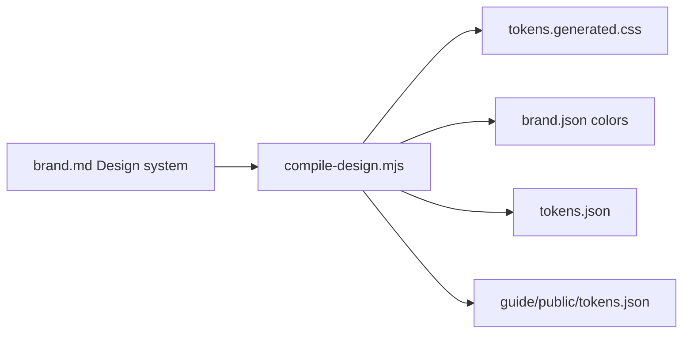

# Plan — DTCG / open-standards design tokens

**Date:** 2026-07-23  
**Plan:** DTCG open-tokens (Southleft-style interchange)  
**Scope:** Generate a Design Tokens Community Group (DTCG) `tokens.json` from the same Design system compile path that already produces CSS and `brand.json` colors (now the fenced section in `brand.md`; historically `DESIGN.md`). Keep `brand.json` as the agent API. Do **not** build a generative theme console.

References: [Southleft tokens.json](https://southleft.com/tokens.json), [DTCG format](https://design-tokens.github.io/community-group/format/), [Substack: AI Proposes. The Design System Disposes.](https://southleft.substack.com/p/ai-proposes-the-design-system-disposes)

---

## Thesis

AI and design tools are only as good as the structured context they can reach. This kit already treats `DESIGN.md` as the single source of truth and generates CSS + agent colors. The missing piece for **open standards** is a portable DTCG artifact—generated at compile time, never hand-maintained—so Style Dictionary, Tokens Studio, Figma plugins, and external agents share the same vocabulary the guide runs on.

**AI proposes. The design system disposes.** For this repo, that means: agents may edit `DESIGN.md` (or propose token values into it); compile resolves into CSS + `brand.json` + DTCG. Models do not emit one-off hex into the guide shell.

---

## Non-goals

| Out of scope | Why |
| --- | --- |
| Generative “describe a vibe” theme console | Product demo, not kit core |
| Contrast solver / OKLCH palette engine UI | Phase-parked; not required for DTCG export |
| `@property` theme crossfades | Polish; orthogonal to interchange |
| Replacing `brand.json` with DTCG | Agent API carries voice, rules, guide payload |
| Full primitive palette redesign in Phase 1 | Flat semantic hex matches current CSS; aliases are Phase 2 |
| MCP token server | Parked |

---

## Target architecture



| Artifact | Audience | Format | Editable? |
| --- | --- | --- | --- |
| `brand.md` Design system | Humans + agents (authoring) | Markdown tables + `:root` CSS | Yes (brand-owned) |
| `guide/src/styles/tokens.generated.css` | Guide runtime | CSS custom properties | No — compile only |
| `brand.json` → `color.tokens` | In-repo agents | Custom agent schema (`value` / `type` / `usage` / WCAG) | No — compile only |
| `tokens.json` (repo root) | Interchange / DS tools / external agents | DTCG (`$value` / `$type` / `$description`) | No — compile only |
| `guide/public/tokens.json` | Browser / deployed guide | Same bytes as root | No — copy on compile |

Ownership (see [`UPSTREAM.md`](../UPSTREAM.md)): `tokens.json` and `guide/public/tokens.json` join the **Generated** zone alongside `tokens.generated.css`. Source remains brand-owned `brand.md` Design system section.

> **Note (2026-07-27):** Theme authoring moved from a standalone `DESIGN.md` into the fenced Design system section of `brand.md`. Compile still uses the same token parsers.
---

## Current state (baseline)

| Piece | Status |
| --- | --- |
| Parse tables + `:root` from `DESIGN.md` | Done — [`scripts/compile-design.mjs`](../scripts/compile-design.mjs) |
| Write `tokens.generated.css` | Done |
| Rebuild `brand.json` colors + guide swatches | Done |
| Golden fixture for Sample Brand `brand.json` | Done — [`scripts/validate-brand.mjs`](../scripts/validate-brand.mjs) |
| DTCG export | Done — `tokens.json` + `guide/public/tokens.json` |
| Docs say “W3C-style names” | Fixed — DTCG / agent names |

Token map already available in compile as `Map<string, TokenDef>` (`--color-ink` → `{ value, usage, guide }`). Phase 1 serializes that map; it does not re-parse CSS from disk as a second source of truth.

---

## DTCG contract (Phase 1)

### File header

```json
{
  "$description": "Brand Guide design tokens — DTCG format. Generated at compile time from DESIGN.md (same pass as tokens.generated.css). Do not edit by hand."
}
```

### Grouping (map from `--*` names)

| CSS prefix / pattern | DTCG group | `$type` | Notes |
| --- | --- | --- | --- |
| `--color-*` | `color` | `color` | Leaf key = strip `--color-` → `ink`, `ink-muted`, … Nested under `color` group. Hex (or css color string) as `$value`. |
| `--font-sans` | `font` | `fontFamily` | Parse comma-separated families into a string array when possible; otherwise single string. |
| `--font-size-*` | `text` | `dimension` or string | Express `clamp()` / rem **as-is** (Southleft pattern for fluid type). Prefer `$type: "dimension"` only when value is a simple `Npx`/`Nrem`; otherwise use a documented extension or keep string `$value` with `$description` noting CSS expression. **Locked choice:** use `$type: "dimension"` with `$value` as the raw CSS string for fluid sizes (same practical compromise as Southleft `text.*`), and document that tools may treat these as opaque CSS. |
| `--font-weight-*` | `font` (weights) or `text` | `fontWeight` | Numeric weights. |
| `--line-height-*` | `text` | `number` | Unitless multipliers. |
| `--space-*` | `space` | `dimension` | rem values. |
| `--content-max`, `--guide-max` | `layout` | `dimension` | |
| `--radius-*` | `radius` | `dimension` | |

Unknown `--*` tokens: place under `misc` with best-effort `$type` from value shape, or fail compile if the name does not match a known prefix (prefer **fail loud** for unexpected prefixes once the starter set is covered).

### Token object shape

```json
{
  "color": {
    "ink": {
      "$type": "color",
      "$value": "#111111",
      "$description": "Primary text, key chrome, CTAs",
      "$extensions": {
        "com.brand-guide": {
          "css": "--color-ink",
          "guide": "brand"
        }
      }
    }
  }
}
```

- `$description` ← DESIGN table **Usage** when present.
- `$extensions.com.brand-guide.css` ← original custom property name.
- `$extensions.com.brand-guide.guide` ← Guide layer (`brand` | `secondary` | `interface` | `chrome`) after `resolveGuideLayer`.
- Phase 1: **resolved values only** — no `{color.ink}` aliases (matches flat CSS today).
- Do **not** duplicate WCAG grades into DTCG; those stay on `brand.json` agent tokens.

### Dual write

1. Write pretty-printed JSON to repo root `tokens.json`.
2. Copy identical bytes to `guide/public/tokens.json` so the running guide can link `/tokens.json`.

Both are generated; neither is authored.

### Fail conditions (compile exits non-zero)

- Zero tokens after merge (existing).
- No `--color-*` entries with parseable color values when `brand.json` exists (or always require at least `color-ink` + `color-paper`).
- DTCG serialize throws / produces empty `color` group.
- After write, re-read root file and assert `color.ink.$value` (or Sample Brand equivalent) is non-empty.

---

## Work queue

Work top to bottom. Check items off when done. Skip parked items unless needed.

### Now / next — Phase 1 (Interchange export)

- [x] **H1** — Emit DTCG from `compile-design.mjs` (root `tokens.json` + `guide/public/tokens.json`)
- [x] **H2** — Fail loud on missing required colors / empty DTCG color group
- [x] **M1** — Validate DTCG in `validate-brand.mjs` (existence + key paths + optional golden slice)
- [x] **M2** — Docs: README, UPSTREAM, DESIGN.md — DTCG vs agent API; retire “W3C-style names”
- [x] **M3** — Sync examples: `examples/DESIGN.default.md` (and other DESIGN examples) wording to match
- [x] **L1** — Guide UI: tertiary link to `/tokens.json` on Visual or Tokens section (shell-owned; small)

### Later — Phase 2 (Alias tier)

- [ ] **H3** — Authoring convention for primitives + semantic refs in `DESIGN.md`
- [ ] **H4** — Compile CSS with `var(--…)` / alias-friendly output; DTCG `$value: "{color.…}"` refs
- [ ] **M4** — Document how agents should re-point aliases vs edit primitives

### Parked

- [ ] **P1** — Generative theme knobs / vibe console
- [ ] **P2** — Contrast solver encoded in compile
- [ ] **P3** — Root `/brand.txt` pointing at brand.md + tokens.json
- [ ] **P4** — MCP design-tokens tool
- [ ] **P5** — “Copy tokens (DTCG)” button in guide chrome

### Batches

| Batch | Items | Suggested PR |
| --- | --- | --- |
| 1 | H1 → H2 → M1 | Compiler + validation |
| 2 | M2 → M3 → L1 | Docs + light guide link |
| 3 | H3 → H4 → M4 | Alias tier (separate PR after Batch 1–2 green) |

---

## Detail — Phase 1 items

### H1 — Emit DTCG from compile-design

**Touch:** [`scripts/compile-design.mjs`](../scripts/compile-design.mjs)

After `mergeTokens` / `renderTokensCss`:

1. Add `renderTokensDtcg(tokens)` → object matching the contract above.
2. `JSON.stringify(doc, null, 2) + "\n"` → `tokens.json` at kit root.
3. `fs.copyFileSync` (or write same string) → `guide/public/tokens.json` (mkdir `-p`).
4. Update file header comment in `compile-design.mjs` to list both outputs.
5. Log: `Wrote N DTCG tokens → tokens.json (+ public copy)`.

**Do not** invent a second parser that reads `tokens.generated.css` for Phase 1—use the in-memory map (stylesheet and DTCG stay twins of the same merge).

### H2 — Fail loud

**Touch:** [`scripts/compile-design.mjs`](../scripts/compile-design.mjs)

Require at least `--color-ink` and `--color-paper` with `isColorValue`. If DTCG `color` group has zero leaves, `process.exit(1)`.

### M1 — Validation / golden

**Touch:** [`scripts/validate-brand.mjs`](../scripts/validate-brand.mjs), optionally `scripts/fixtures/tokens.sample.expected.json`

Minimum smoke (always):

- Root `tokens.json` exists after compile.
- `guide/public/tokens.json` exists and byte-equals root (or deep-equal JSON).
- `color.ink.$value` and `color.paper.$value` present (Sample Brand).
- Top-level `$description` mentions generated / DESIGN.md.

Golden (recommended): snapshot a stabilized DTCG file for Sample Brand under `scripts/fixtures/tokens.sample.expected.json`, compared on `compile:check`. Regenerate with the same `UPDATE_GOLDEN=1` path or a dedicated flag documented in validate script header. Keep volatile-free (DTCG should have no timestamps).

### M2 — Documentation

| File | Change |
| --- | --- |
| [`README.md`](../README.md) | Edit→compile table: add `tokens.json` (+ public copy). Agent load order: DTCG for design-tool interchange; `brand.json` for brand constitution / guide payload. |
| [`UPSTREAM.md`](../UPSTREAM.md) | Generated zone lists both `tokens.json` paths. |
| [`DESIGN.md`](../DESIGN.md) | Replace **W3C-style names** section with **DTCG / agent names**: `color-ink` in `brand.json`; DTCG path `color.ink`; both derived on compile. Point to root `tokens.json`. |
| [`agent.md`](../agent.md) | One line: prefer `tokens.json` when emitting or validating design tokens for external tools; prefer `brand.json` for voice/rules/guide. |

### M3 — Examples sync

**Touch:** [`examples/DESIGN.default.md`](../examples/DESIGN.default.md), [`DESIGN.sample.md`](../DESIGN.sample.md) if present, any `examples/DESIGN.*.md` that copy the W3C wording.

Same wording change as DESIGN.md so `tokens:reset` does not resurrect the old section title.

### L1 — Guide link

**Touch:** shell component under `guide/src/` that owns Visual / tokens display (find existing swatch or footer section).

Add a quiet text link: “Design tokens (DTCG)” → `/tokens.json`. No new card chrome. Skip if no natural placement without layout churn—then leave as docs-only until a follow-up.

---

## Detail — Phase 2 (after Phase 1 green)

### H3 / H4 — Alias tier

Introduce in `DESIGN.md` a clear split, e.g.:

- Primitives table: `--palette-ink-900: #111111`
- Semantic table: `--color-ink: var(--palette-ink-900)` (or DTCG-first authoring that compile expands)

Compile must:

1. Emit CSS that preserves references where authors used `var(...)`.
2. Emit DTCG semantic tokens with `$value: "{color.palette.ink-900}"` (or agreed path scheme) while primitives hold hex.
3. Keep `brand.json` agent tokens **resolved** (agents still get concrete hex + WCAG) unless a later decision says otherwise—default: resolve for `brand.json`, alias for DTCG.

Document the path scheme once in DESIGN.md so agents do not invent parallel naming.

---

## Acceptance criteria

### Phase 1 done when

1. `cd guide && npm run compile` writes root `tokens.json` and `guide/public/tokens.json` with identical JSON.
2. Sample Brand DTCG includes `color.ink`, `color.paper`, at least one `space.*`, and font/text entries derived from DESIGN.
3. `npm run compile:check` fails if either DTCG file is missing or `color.ink.$value` drifts from DESIGN without updating golden (when golden is wired).
4. README + UPSTREAM + DESIGN no longer claim “W3C-style” as the interchange format; they describe DTCG vs `brand.json`.
5. No hand-edited DTCG committed as source—only as compile output (same policy as `brand.json`).
6. Shell still themes only via `DESIGN.md` / `brand/overrides.css` (UPSTREAM rule unchanged).

### Phase 2 done when

1. At least one semantic color in DTCG uses a `{…}` alias to a primitive.
2. Changing a primitive and recompiling updates all aliased semantics in CSS and DTCG without editing each semantic row’s hex by hand.

---

## Dual-audience reminder

| Need | Use |
| --- | --- |
| Strategy, voice, examples, rules, guide copy | `brand.md` → `brand.json` |
| Theme authoring | `brand.md` Design system |
| CSS for this Next guide | `tokens.generated.css` |
| Portable design tokens (Figma / Style Dictionary / external agents) | `tokens.json` (DTCG) |
| In-repo agent color + WCAG helpers | `brand.json` → `color.tokens` |

---

## Open questions (resolved for implementers)

| Question | Decision |
| --- | --- |
| Root only vs public copy? | **Both** — root for repo/agents; public for deployed guide URL |
| Replace brand.json colors? | **No** |
| Aliases in Phase 1? | **No** — resolved hex only |
| Fluid `clamp()` in DTCG? | **Raw CSS string** under `text.*`, documented as opaque CSS |
| Extension namespace | `com.brand-guide` |
| Parse CSS file for DTCG? | **No** — same in-memory map as CSS emit |

---

## Review checklist (authoring gate)

- [x] Every work item names the file/script to touch
- [x] Dual-audience preserved (`brand.json` vs DTCG)
- [x] Clone-per-brand / UPSTREAM ownership unchanged (tokens still brand-owned via brand.md Design system)
- [x] No hand-maintained DTCG snapshot as source of truth
- [x] Non-goals prevent scope creep into Southleft’s demo features
- [x] Acceptance criteria are testable (`npm run compile` / `compile:check`)

---

## Hand-off

This document is the **execution plan**. Implementing Phase 1 (Batch 1–2) is a separate Agent turn—do not start coding until explicitly asked to execute this plan’s work queue.
